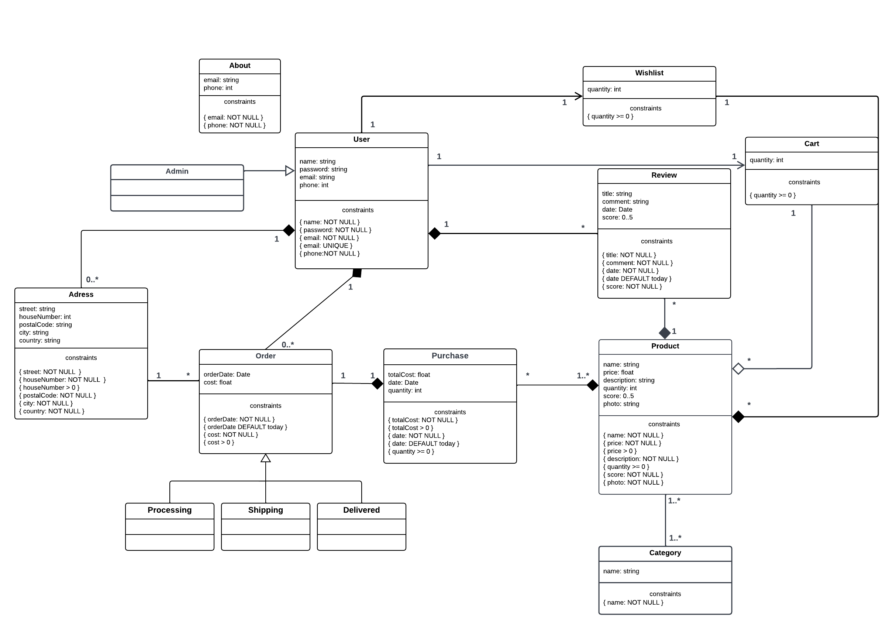

# EBD: Database Specification Component

 OnlyT3ch é uma plataforma web de compras online que permite aos seus utlizadores acesso a um vasto catálogo de produtos informáticos.
 
## A4: Conceptual Data Model

Este artefacto representa as principais entidades organizacionais, os relacionamentos entre elas, os atributos e a multiplicidade de relacionamentos para o site da Onlyt3ch.

### 1. Class diagram

  


### 2. Additional Business Rules
 
- BR01. Um utilizador não pode avaliar produtos que não tenha adquirido.
- BR02. O preço dos produtos têm de ser um valor positivo.
- BR03. O valor total da encomenda é a soma dos preços de todos os pordutos comprados.
- BR04. A conta dos administradores é independente da conta dos utilizadores,uma vez que estes não podem efetuar compras.


---


## A5: Relational Schema, validation and schema refinement

Este artefato contém o Esquema Relacional obtido pelo mapeamento do Modelo de Dados Conceituais. O Esquema Relacional inclui cada esquema de relação, atributos, domínios, chaves primárias, chaves estrangeiras e outras regras de integridade: UNIQUE, DEFAULT, NOT NULL, CHECK.

### 1. Relational Schema
 

| Relation reference | Relation Compact Notation                        |
| ------------------ | ------------------------------------------------ |
| R01                | user( __id__, name __NN__, password __NN__, email __NN__ __UK__, phone __NN__)                     |
| R02                | admin( __user_id__ → user)            |
| R03                | category( __id__, name __NN__) |
| R04                | cart(  __user_id__ → user, __product_id__ → product, quantity __CK__ quantity >= 0) |
| R05                | address( __id__, __user_id__ → user, street __NN__, houseNumber __NN__ __CK__ houseNumber > 0, postalCode __NN__, city __NN__, country __NN__ ) |
| R06                | order( __id__, __user_id__ → user, __address_id__ → address, __purchase_id__ → purchase, orderDate __NN__ __DF__ Today, cost __NN__ __CK__ cost > 0, status __NN__ __CK__ status __IN__ Status ) |
| R07                | product( __id__, __category_id__ → category, name __NN__, price __NN__ __CK__ price > 0, description __NN__, quantity __NN__ __CK__ quantity >= 0 ,score __CK__ score > 0 AND score <= 5, photo __NN__ ) | 
| R08                | purchase( __id__,__product_id__ → product, totalCost __NN__ __CK__ totalCost > 0, date __NN__ __DF__ Today, quantity __CK__ quantity >= 0) |
| R09                | productPurchase (__product_id__ → product, __purchase_id__ → purchase) |
| R10                | review( __user_id__ → user, __product_id__ → product, title __NN__, comment __NN__, date __NN__ __DF__ Today, score __CK__ score > 0 AND score <= 5  ) |
| R11                | wishlist( __user_id__ → User, __product_id__ → product,  quantity __CK__ quantity >= 0 )   |
| R12                | about( __id__, email __NN__, phone __NN__ ) |

### Legenda:
  -  UK = UNIQUE KEY
  -  NN = NOT NULL
  -  DF = DEFAULT
  -  CK = CHECK
  
### 2. Domains


| Domain Name | Domain Specification           |
| ----------- | ------------------------------ |
| Today	      | DATE DEFAULT CURRENT_DATE      |
| Status      | ENUM ('Processing', 'Shipping', 'Delivered') |

### 3. Schema validation


| **TABLE R01**   | User               |
| --------------  | ---                |
| **Keys**        | { id }, { email }  |
| **Functional Dependencies:** |       |
| FD0101          | {id} → {email, name, password, phone} |
| FD0102          | email → {id, name, password, phone} |
| **NORMAL FORM** | BCNF               |

| **TABLE R02**   | Admin              |
| --------------  | ---                |
| **Keys**        | { id } |
| **NORMAL FORM** | BCNF               |

| **TABLE R03**   | Category              |
| --------------  | ---                |
| **Keys**        | { id }  |
| **Functional Dependencies:** |       |
| FD0301          | {id} → {name} |
| **NORMAL FORM** | BCNF               |

| **TABLE R04**   | Cart               |
| --------------  | ---                |
| **Keys**        | { User_id, Product_id }  |
| **Functional Dependencies:** |       |
| FD0401          | {User_id, Product_id} → {quantity} |
| **NORMAL FORM** | BCNF               |

| **TABLE R05**   | Address              |
| --------------  | ---                |
| **Keys**        | { id }  |
| **Functional Dependencies:** |       |
| FD0501          | {id} → {street, houseNumber, postalCode, city, country, User_id} |
| **NORMAL FORM** | BCNF               |

| **TABLE R06**   | Order               |
| --------------  | ---                |
| **Keys**        | { id }  |
| **Functional Dependencies:** |       |
| FD0601          | {id} → {orderDate, cost, deliveryDate, User_id, Address_id, Purchase_id} |
| **NORMAL FORM** | BCNF               |

| **TABLE R07**   | Product               |
| --------------  | ---                |
| **Keys**        | { id }  |
| **Functional Dependencies:** |       |
| FD0701          | {id} → {name, price, description, quantity, score, photo, Category_id} |
| **NORMAL FORM** | BCNF               |

| **TABLE R08**   | Purchase               |
| --------------  | ---                |
| **Keys**        | { id }  |
| **Functional Dependencies:** |       |
| FD0901          | {id} → {totalCost, date, status,quantity, Product_id} |
| **NORMAL FORM** | BCNF               |

| **TABLE R09**   | productPurchase               |
| --------------  | ---                |
| **Keys**        | { product_id, purchase_id}  |
| **NORMAL FORM** | BCNF               |

| **TABLE R10**   | Review               |
| --------------  | ---                |
| **Keys**        | { id }  |
| **Functional Dependencies:** |       |
| FD0801          | {id} → {title, comment, date, score,User_id, Product_id} |
| **NORMAL FORM** | BCNF               |

| **TABLE R11**   | Wishlist               |
| --------------  | ---                |
| **Keys**        |  {User_id, Product_id}|
| **Functional Dependencies:** |       |
| FD0901          | {User_id, Product_id} → {quantity} |
| **NORMAL FORM** | BCNF               |

| **TABLE R12**   | About               |
| --------------  | ---                |
| **Keys**        | { id }  |
| **Functional Dependencies:** |       |
| FD0901          | {id} → {email, phone} |
| **NORMAL FORM** | BCNF               |

Como todas as relações estão na forma normal de Boyce-Codd (BCNF), o esquema relacional também está no BCNF e, portanto, o esquema não precisa ser normalizado posteriormente.


---


## A6: Indexes, triggers, transactions and database population

Este artefacto contém o esquema físico da base de dados, índicies, triggers e transações necessárias para garantir a integridade dos dados. Contém também uma precisão do crescimento e da magnitude da base de dados,assim como um script completo da sua criação, incluindo todo o SQL necessário.

### 1. Database Workload
 

| **Relation reference** | **Relation Name** | **Order of magnitude**        | **Estimated growth** |
| ------------------ | ------------- | ------------------------- | -------- |
| R01                | User       | 10 k (tens of thousands) | 10 (tens) / day |
| R02                | Admin        | 100 (hundreds) | 1 (units) / day| 
| R03                | Category       | 10  | no growth |
| R04                | Cart       | 10 k  | 100 / day |
| R05                | Address      | 10 k  | 10 / day |
| R06                | Order       | 1 k  | 10 / day |
| R07                | Product       | 100   | 1 / month |
| R08                | Purchase       | 1 k  | 10 / day |
| R09                | ProductPurchase       | 1 k  | 10 / day |
| R10                | Review       | 1 k  | 10 / day |
| R11                | Wishlist       | 1 k  | 10 / day |
| R12                | About       | 1  | no growth |


### 2. Proposed Indices

#### 2.1. Performance Indices
 

| **Index**           | IDX01                                  |
| ---                 | ---                                    |
| **Relation**        | 	Purchase   |
| **Attribute**       |  	id_Users   |
| **Type**            | Hash             |
| **Cardinality**     | Medium |
| **Clustering**      | No             |
| **Justification**   | Table 'Purchase'  is frequently accessed to obtain a user’s Purchases.Filtering is done by exact match, thus an hash type is best suited. However, expected update frequency is medium, so no clustering is proposed.  |
```sql
CREATE INDEX userid_purchase ON Purchase USING hash (id_Users);
```
| **Index**           | IDX02                                  |
| ---                 | ---                                    |
| **Relation**        | 	Review   |
| **Attribute**       |  	id_Product   |
| **Type**            | Hash             |
| **Cardinality**     | Medium |
| **Clustering**      | No              |
| **Justification**   | Table 'Review'  is frequently accessed to obtain a product’s Review.Filtering is done by exact match, thus an hash type is best suited.However, expected update frequency is medium, so no clustering is proposed.   |
```sql
CREATE INDEX idproduct_review ON Review USING hash (id_Product);
```
| **Index**           | IDX03                                  |
| ---                 | ---                                    |
| **Relation**        | 	Product   |
| **Attribute**       |  	id_Category   |
| **Type**            | Hash             |
| **Cardinality**     | Medium |
| **Clustering**      | No              |
| **Justification**   | The query that gets the products of a certain category is executed several times so it has to be fast. However, expected update frequency is medium, so no clustering is proposed.   |
```sql
CREATE INDEX idcategory_product ON Product USING hash (id_Category);
```

| **Index**           | IDX04                                  |
| ---                 | ---                                    |
| **Relation**        | 	Product   |
| **Attribute**       |  	price  |
| **Type**            |  	B-tree            |
| **Cardinality**     | High |
| **Clustering**      | Yes             |
| **Justification**   | Table ‘Product’ is frequently accessed for Products filtered by the lower prices. A b-tree index allows for faster price range queries based on the lower price  |
```sql
CREATE INDEX price_product ON Product USING btree (price);
```

#### 2.2. Full-text Search Indices 

| **Index**           | IDX05                                  |
| ---                 | ---                                    |
| **Relation**        | Product    |
| **Attribute**       | Name   |
| **Type**            | GIN             |
| **Clustering**      | NO                |
| **Justification**   | Used for improving the performance of full text search while searching for a specific term in of the biggest table of the database, 'task'. GIN was used because a task's name and description are not updated frequently.   |
```sql
ALTER TABLE Product
ADD COLUMN tsvectors TSVECTOR;

CREATE FUNCTION product_search_update() RETURNS TRIGGER AS $$
BEGIN
IF TG_OP = 'INSERT' THEN
  NEW.tsvectors = (
    setweight(to_tsvector('english', New.name), 'A') || setweight(to_tsvector('english', New.description), 'B')
  );
END IF;
IF TG_OP = 'UPDATE' THEN
  IF (New.name <> Old.name OR New.description <> Old.description) THEN
    New.tsvectors = (
      setweight(to_tsvector('english', New.name), 'A') || setweight(to_tsvector('english', New.description), 'B')
    );
  END IF;
END IF;
RETURN New;
END $$
LANGUAGE plpgsql;

CREATE TRIGGER product_search_update
BEFORE INSERT OR UPDATE ON Product
FOR EACH row
EXECUTE PROCEDURE product_search_update();

CREATE INDEX search_idx ON Product USING GIN(tsvectors);
```


### 3. Triggers
 

| **Trigger**      | TRIGGER01                              |
| ---              | ---                                    |
| **Description**  | Update products' score according to all existing reviews |
```sql
CREATE OR REPLACE FUNCTION update_product_score() RETURNS TRIGGER AS
$BODY$
BEGIN
	UPDATE Product
	SET score = (SELECT AVG(score) FROM Review WHERE id_Product = New.id_Product)
	WHERE id_Product = New.id_Product;
RETURN NEW;
END
$BODY$
LANGUAGE plpgsql;

CREATE TRIGGER product_score AFTER INSERT OR UPDATE OR DELETE
ON Review
FOR EACH ROW
EXECUTE PROCEDURE update_product_score();
```

| **Trigger**      | TRIGGER02                              |
| ---              | ---                                    |
| **Description**  | An user can't buy more than the available quantity of products |
```sql
CREATE FUNCTION check_purchase_quantities() RETURNS TRIGGER AS
$BODY$
BEGIN
	IF
		NOT EXISTS (SELECT quantity FROM Product WHERE id_Product = New.id_Product AND quantity >= New.quantity)
	THEN
		RAISE EXCEPTION 'You can’t buy % items of product %' , New.quantity, New.id_Product;
	END IF;
	RETURN NEW;
END
$BODY$
LANGUAGE plpgsql;

CREATE TRIGGER check_purchase_quantities BEFORE INSERT
ON Purchase
FOR EACH ROW
EXECUTE PROCEDURE check_purchase_quantities();
```

| **Trigger**      | TRIGGER03                              |
| ---              | ---                                    |
| **Description**  | When a user buys a product it is removed from it's cart |
```sql
CREATE FUNCTION clear_cart() RETURNS TRIGGER AS
$BODY$
BEGIN
	DELETE FROM Cart
	WHERE id_Users = New.id_Users;

RETURN NEW;
END
$BODY$
LANGUAGE plpgsql;

CREATE TRIGGER clear_cart AFTER INSERT
ON Purchase
EXECUTE PROCEDURE clear_cart();
```
| **Trigger**      | TRIGGER04                              |
| ---              | ---                                    |
| **Description**  | If a wishlist's product is added to the cart it is removed from the wishlist |
```sql
CREATE FUNCTION remove_wishlist_product() RETURNS TRIGGER AS
$BODY$
BEGIN
	DELETE FROM Wishlist
	WHERE id_Users = New.id_Users
  AND id_Product = New.id_Product;
RETURN NEW;  
END
$BODY$
LANGUAGE plpgsql;

CREATE TRIGGER remove_wishlist_product AFTER INSERT
ON Cart
EXECUTE PROCEDURE remove_wishlist_product();
```

| **Trigger**      | TRIGGER05                              |
| ---              | ---                                    |
| **Description**  | When a product is bought its available quantity is reduced |
```sql
CREATE FUNCTION update_available_products() RETURNS TRIGGER AS
$BODY$
BEGIN
  UPDATE Product
  SET quantity = quantity - New.quantity
  WHERE id_Product = New.id_Product;
RETURN NEW;   
END
$BODY$
LANGUAGE plpgsql;

CREATE TRIGGER update_available_products AFTER INSERT
ON Purchase
EXECUTE PROCEDURE update_available_products();

```

### 4. Transactions
 
> Transactions needed to assure the integrity of the data.  

| SQL Reference   | TRAN01                   |
| --------------- | ----------------------------------- |
| Justification   |In the middle of the transaction, the insertion of new rows in the review table can occur, which implies that the information retrieved in the query that selects the reviews counter and the query that selects the reviews is different, consequently resulting in a Phantom Read. It's READ ONLY because it only uses Selects.  |
| Isolation level |  	SERIALIZABLE READ ONLY |
```sql
    BEGIN TRANSACTION;
    SET TRANSACTION ISOLATION LEVEL SERIALIZABLE READ ONLY;

    SELECT COUNT(*)
    FROM Review AS R
    WHERE R.id_Product = id_Product;

    SELECT R.title, R.comment, R.creationDate, R.score, U.name
    FROM Review AS R, User AS U
    WHERE R.id_Product = id_Product;

  END TRANSACTION;                          
```

## Annex A. SQL Code


### A.1. Database schema

```sql
CREATE SCHEMA lbaw22114;

SET search_path TO lbaw22114;

CREATE DOMAIN "Today" AS date NOT NULL DEFAULT ('now'::text)::date;

DROP TABLE IF EXISTS Users CASCADE;
DROP TABLE IF EXISTS Address CASCADE;
DROP TABLE IF EXISTS Category CASCADE;
DROP TABLE IF EXISTS Product CASCADE;
DROP TABLE IF EXISTS Review CASCADE;
DROP TABLE IF EXISTS Wishlist CASCADE;
DROP TABLE IF EXISTS Purchase CASCADE;
DROP TABLE IF EXISTS ProductPurchase CASCADE;
DROP TABLE IF EXISTS Orders CASCADE;
DROP TABLE IF EXISTS Cart CASCADE;
DROP TABLE IF EXISTS AdminUsers CASCADE;
DROP TABLE IF EXISTS About CASCADE;

create table Users(
  id_Users SERIAL PRIMARY KEY,
  name TEXT NOT NULL,
  password TEXT NOT NULL,
  email VARCHAR(128) UNIQUE NOT NULL,
  phone INT NOT NULL
);

create table Address(
  id_Address SERIAL PRIMARY KEY,
  houseNumber INTEGER NOT NULL CHECK (houseNumber > 0),
  postalCode TEXT NOT NULL,
  city TEXT NOT NULL,
  country TEXT NOT NULL,
  id_Users INTEGER REFERENCES Users(id_Users) ON DELETE CASCADE
);

create table Category(
  id_Category SERIAL PRIMARY KEY,
  name TEXT NOT NULL
);

create table Product(
  id_Product SERIAL PRIMARY KEY,
  name TEXT NOT NULL,
  price FLOAT NOT NULL CHECK (price > 0),
  description TEXT NOT NULL,
  quantity INTEGER NOT NULL CHECK (quantity >= 0),
  score FLOAT CHECK (score >= 0 AND score <= 5),
  photo TEXT NOT NULL,
  id_Category INTEGER REFERENCES Category(id_Category)
);

create table Review(
  id_Review SERIAL PRIMARY KEY,
  title TEXT NOT NULL,
  comment TEXT NOT NULL,
  creationDate TIMESTAMP WITH TIME ZONE DEFAULT now() NOT NULL,
  score FLOAT CHECK (score >= 0 AND score <= 5),
  id_Users INTEGER REFERENCES Users(id_Users) ON DELETE CASCADE,
  id_Product INTEGER REFERENCES Product(id_Product)
);

create table Wishlist(
  id_Users INTEGER REFERENCES Users(id_Users),
  id_Product INTEGER REFERENCES Product(id_Product),
  quantity INTEGER CHECK (quantity >= 0)
);

create table Purchase(
  id_Purchase SERIAL PRIMARY KEY,
  totalCost FLOAT NOT NULL CHECK (totalCost > 0),
  purchaseDate TIMESTAMP WITH TIME ZONE DEFAULT now() NOT NULL,
  quantity INTEGER CHECK (quantity >= 0),
  id_Product INTEGER REFERENCES Product(id_Product)
);

create table ProductPurchase(
  id_Product INTEGER REFERENCES Product(id_Product),
  id_Purchase INTEGER REFERENCES Purchase(id_Purchase),
  PRIMARY KEY(id_Product, id_Purchase)
);

create table Orders(
  id_PurchaseOrder SERIAL PRIMARY KEY,
  orderDate TIMESTAMP WITH TIME ZONE DEFAULT now() NOT NULL,
  cost FLOAT NOT NULL CHECK (cost > 0),
  status TEXT NOT NULL,
  id_Users INTEGER REFERENCES Users(id_Users),
  id_Address INTEGER REFERENCES Address(id_Address) ON DELETE CASCADE,
  id_Purchase INTEGER REFERENCES Purchase(id_Purchase) ON DELETE CASCADE,
  CONSTRAINT status CHECK (status IN ('Processing', 'Shipping', 'Delivered'))
);

create table Cart(
  id_Users INTEGER REFERENCES Users(id_Users),
  id_Product INTEGER REFERENCES Product(id_Product),
  quantity INTEGER CHECK (quantity >= 0)
);

create table AdminUsers(
  id_Users INTEGER PRIMARY KEY REFERENCES Users(id_Users)
);

create table About(
  id_About SERIAL PRIMARY KEY,
  email TEXT NOT NULL,
  phone INTEGER NOT NULL
);

-- INDEX 1
CREATE INDEX userid_order ON Orders USING hash (id_Users);

-- INDEX 2
CREATE INDEX idproduct_review ON Review USING hash (id_Product);

-- INDEX 3
CREATE INDEX idcategory_product ON Product USING hash (id_Category);

-- INDEX 4
CREATE INDEX price_product ON Product USING btree (price);

-- INDEX 5
ALTER TABLE Product
ADD COLUMN tsvectors TSVECTOR;

CREATE OR REPLACE FUNCTION product_search_update() RETURNS TRIGGER AS $$
BEGIN
IF TG_OP = 'INSERT' THEN
  NEW.tsvectors = (
    setweight(to_tsvector('english', New.name), 'A') || setweight(to_tsvector('english', New.description), 'B')
  );
END IF;
IF TG_OP = 'UPDATE' THEN
  IF (New.name <> Old.name OR New.description <> Old.description) THEN
    New.tsvectors = (
      setweight(to_tsvector('english', New.name), 'A') || setweight(to_tsvector('english', New.description), 'B')
    );
  END IF;
END IF;
RETURN New;
END $$
LANGUAGE plpgsql;

CREATE OR REPLACE TRIGGER product_search_update
BEFORE INSERT OR UPDATE ON Product
FOR EACH row
EXECUTE PROCEDURE product_search_update();

CREATE INDEX search_idx ON Product USING GIN(tsvectors);

-- TRIGGER 1
CREATE OR REPLACE FUNCTION update_product_score() RETURNS TRIGGER AS
$BODY$
BEGIN
	UPDATE Product
	SET score = (SELECT AVG(score) FROM Review WHERE id_Product = New.id_Product)
	WHERE id_Product = New.id_Product;
RETURN NEW;
END
$BODY$
LANGUAGE plpgsql;

CREATE OR REPLACE TRIGGER product_score AFTER INSERT OR UPDATE OR DELETE
ON Review
FOR EACH ROW
EXECUTE PROCEDURE update_product_score();

-- TRIGGER 2
CREATE OR REPLACE FUNCTION check_purchase_quantities() RETURNS TRIGGER AS
$BODY$
BEGIN
	IF NOT EXISTS (SELECT quantity FROM Product WHERE id_Product = New.id_Product AND quantity >= New.quantity)
	THEN
		RAISE EXCEPTION 'You can’t buy % items of product %' , New.quantity, New.id_Product;
	END IF;
	RETURN NEW;
END
$BODY$
LANGUAGE plpgsql;

CREATE OR REPLACE TRIGGER check_purchase_quantities BEFORE INSERT
ON Purchase
FOR EACH ROW
EXECUTE PROCEDURE check_purchase_quantities();

-- TRIGGER 3
CREATE OR REPLACE FUNCTION clear_cart() RETURNS TRIGGER AS
$BODY$
BEGIN
	DELETE FROM Cart
	WHERE id_Users = New.id_Users;
  RETURN NEW;
END
$BODY$
LANGUAGE plpgsql;

CREATE OR REPLACE TRIGGER clear_cart AFTER INSERT
ON Orders
FOR EACH ROW
EXECUTE PROCEDURE clear_cart();

-- TRIGGER 4
CREATE OR REPLACE FUNCTION remove_wishlist_product() RETURNS TRIGGER AS
$BODY$
BEGIN
	DELETE FROM Wishlist
	WHERE id_Users = New.id_Users
  AND id_Product = New.id_Product;
RETURN NEW;
END
$BODY$
LANGUAGE plpgsql;

CREATE OR REPLACE TRIGGER remove_wishlist_product AFTER INSERT
ON Cart
FOR EACH ROW
EXECUTE PROCEDURE remove_wishlist_product();

-- TRIGGER 5
CREATE OR REPLACE FUNCTION update_available_products() RETURNS TRIGGER AS
$BODY$
BEGIN
  UPDATE Product
  SET quantity = Product.quantity - New.quantity
  WHERE id_Product = New.id_Product;
  RETURN NEW;
END
$BODY$
LANGUAGE plpgsql;

CREATE OR REPLACE TRIGGER update_available_products AFTER INSERT
ON Purchase
FOR EACH ROW
EXECUTE PROCEDURE update_available_products();


```

### A.2. Database population

```sql

-----------------------------------------
-- Populate the database
-----------------------------------------


-- Users
INSERT INTO Users VALUES (1,'Example','Example123','Example@example.com','987654321');
INSERT INTO Users VALUES (2,' Elwood Ellis','tMF3sw6','wood34@gmmail.com','93697524');
INSERT INTO Users VALUES (3,' Tiffani Derek ','QJg4MehPa','tiderek@1232.com','95334314');
INSERT INTO Users VALUES (4,' Timmy Hattie ','MP2p7BhIH','hatie3231@de32.org','90853239');
INSERT INTO Users VALUES (5,' Dave Randi ','9I8ELTY7u','randi53621@gmaiiil.com','99930384');
INSERT INTO Users VALUES (6,' Ira Trinity ','3Th8FkGHv','iraa4253@asd.com','90416185');
INSERT INTO Users VALUES (7,' Ernest Macie ','AbxSjnfyC','23macie123@hotmail.com','93749133');
INSERT INTO Users VALUES (8,' Davey Katrina ','fvuGD9Mye','katrinaa12@869.com','96523660');
INSERT INTO Users VALUES (9,' Hester Araminta ','PqKwgZNUj','hester1524@mail.com','93498111');
INSERT INTO Users VALUES (10,' Essie Lorin ','eevQ9yKbK','lorin132@ess.com','95690506');
INSERT INTO Users VALUES (11,' Josh Jed ','qUM8czLpV','jjed@12321.com','95221856');
INSERT INTO Users VALUES (12,' Demelza Dylan ','GjD9kL3jE','de_dy3431@mail.com','99825607');
INSERT INTO Users VALUES (13,' Dionne Lally ','wTrXHpDfv','ionne213@56gt.com','98317321');
INSERT INTO Users VALUES (14,' Severo Soren ','TxaGa44aT','sorenn_12@ial.com','97749743');
INSERT INTO Users VALUES (15,' Angus Jaimie ','bq85c6Ays','imae32123@hotmail.com','93622457');

-- Admins
INSERT INTO AdminUsers VALUES (1);
INSERT INTO AdminUsers VALUES (2);
INSERT INTO AdminUsers VALUES (3);

-- About
INSERT INTO About VALUES (1, 'onlyt3ch@gmail.com', 9333333);

-- Address
INSERT INTO Address VALUES (1, 2, '5100-123', 'Porto', 'Portugal', 1);
INSERT INTO Address VALUES (2, 109, '2340-12', 'Madrid', 'Spain', 2);
INSERT INTO Address VALUES (3, 2343, '7123-134', 'London', 'England', 3);
INSERT INTO Address VALUES (4, 543, '4523-234', 'Lisbon', 'Portugal', 4);
INSERT INTO Address VALUES (5, 214, '1232-123', 'Paris', 'France', 5);
INSERT INTO Address VALUES (6, 65, '4324-765', 'Aveiro', 'Portugal', 6);
INSERT INTO Address VALUES (7, 123, '2341-543', 'Roma', 'Italy', 7);
INSERT INTO Address VALUES (8, 7657, '3432-353', 'Algarve', 'Portugal', 8);
INSERT INTO Address VALUES (9, 342, '4321-543', 'New York', 'USA', 9);
INSERT INTO Address VALUES (10, 5646, '2414-543', 'Berlim', 'Germany', 10);

-- Category
INSERT INTO Category VALUES (1, 'Smartphones');
INSERT INTO Category VALUES (2, 'Tablets');
INSERT INTO Category VALUES (3, 'Computers');
INSERT INTO Category VALUES (4, 'Accessories');

-- Products
INSERT INTO Product VALUES (1,'Apple iPhone 14 - 512GB - Black', 1399.99 , 'Product specifications:', 7 ,4.7, 'pictures/defaultPicture.png',1);
INSERT INTO Product VALUES (2,'Apple iPhone 14 Pro Max - 256GB - White ', 1629.99 , 'Product specifications:', 9 ,4.9, 'pictures/defaultPicture.png',1);
INSERT INTO Product VALUES (3,'Apple iPhone 13 - 128GB - Blue ', 929.99 , 'Product specifications:', 4 ,4.5, 'pictures/defaultPicture.png',1);
INSERT INTO Product VALUES (4,'Samsung Galaxy S22 Ultra - 128GB - Green ', 1149.99 , 'Product specifications:', 2 ,4.3, 'pictures/defaultPicture.png',1);
INSERT INTO Product VALUES (5,'Samsung Galaxy S22+ - 256GB - Pink Gold  ', 999.99 , 'Product specifications:', 13 ,4.8, 'pictures/defaultPicture.png',1);

INSERT INTO Product VALUES (6,'Apple iPad Pro 12.9'' - 128GB WiFi - Black  ', 1229 , 'Product specifications:', 10 ,4.5, 'pictures/defaultPicture.png',2);
INSERT INTO Product VALUES (7,'Tablet Samsung Galaxy Tab S8 11'' - X706 - 5G - 256GB - Graphite  ', 959.99 , 'Product specifications:', 6 ,4.9, 'pictures/defaultPicture.png',2);
INSERT INTO Product VALUES (8,'Tablet Lenovo Tab M10 Plus 125FU - 128 GB - Wi-Fi - Grey  ', 219.59 , 'Product specifications:', 10 ,4.5, 'pictures/defaultPicture.png',2);

INSERT INTO Product VALUES (9,'Apple MacBook Air 2022 13.6" | M2 CPU 8-core, GPU 10-core | SSD 1TB | 16GB RAM ', 2239.00 , 'Product specifications:', 8 ,4.8, 'pictures/defaultPicture.png',3);
INSERT INTO Product VALUES (10,'Apple MacBook Air 2020 13.3" | M1 CPU 8-core, GPU 7-core | SSD 256GB | 16GB RAM  ', 1359.00 , 'Product specifications:', 2 ,4.2, 'pictures/defaultPicture.png',3);
INSERT INTO Product VALUES (11,'Laptop Lenovo IdeaPad 3 15ADA05 15.6 ', 399.00 , 'Product specifications:', 14 ,3.9, 'pictures/defaultPicture.png',3);
INSERT INTO Product VALUES (12,'Laptop Lenovo Legion 5 Pro 16ACH6H 16', 1499.00 , 'Product specifications:', 7 ,5, 'pictures/defaultPicture.png',3);

INSERT INTO Product VALUES (13,'Stand Asus ROG Throne Qi', 120.59 , 'Product specifications:', 7 ,4.6, 'pictures/defaultPicture.png',4);
INSERT INTO Product VALUES (14,'Headphones Sony WH-1000XM5 Bluetooth ANC NFC Black', 390.90 , 'Product specifications:', 19 ,4.9, 'pictures/defaultPicture.png',4);
INSERT INTO Product VALUES (15,'Powerbank Apple Magsafe Battery Pack', 115 , 'Product specifications:', 14 ,4.4, 'pictures/defaultPicture.png',4);

-- Wishlist
INSERT INTO Wishlist VALUES (1, 1,3);
INSERT INTO Wishlist VALUES (1, 3,2);
INSERT INTO Wishlist VALUES (4, 4,2);
INSERT INTO Wishlist VALUES (4, 7,2);
INSERT INTO Wishlist VALUES (6, 13,2);
INSERT INTO Wishlist VALUES (7, 12,1);
INSERT INTO Wishlist VALUES (10, 10,2);
INSERT INTO Wishlist VALUES (12, 8,3);

-- Cart
INSERT INTO Cart VALUES (4,5,1);
INSERT INTO Cart VALUES (3,8,4);
INSERT INTO Cart VALUES (1,10,6);
INSERT INTO Cart VALUES (7,14,8);
INSERT INTO Cart VALUES (14,15,15);

-- Purchase
INSERT INTO Purchase VALUES (1,321.32,'2022-10-4',2,2);
INSERT INTO Purchase VALUES (2,121.36,'2022-09-1',1,4);
INSERT INTO Purchase VALUES (3,2321.32,'2022-05-3',3,5);
INSERT INTO Purchase VALUES (4,1221.32,'2022-08-2',1,3);
INSERT INTO Purchase VALUES (5,421.32,'2022-10-21',2,3);
INSERT INTO Purchase VALUES (6,821.32,'2022-11-12',2,10);

--ProductPurchase
INSERT INTO ProductPurchase VALUES (1, 4);
INSERT INTO ProductPurchase VALUES (5, 4);
INSERT INTO ProductPurchase VALUES (3, 4);
INSERT INTO ProductPurchase VALUES (8, 4);
INSERT INTO ProductPurchase VALUES (6, 4);
INSERT INTO ProductPurchase VALUES (2, 5);
INSERT INTO ProductPurchase VALUES (2, 6);
INSERT INTO ProductPurchase VALUES (5, 5);
INSERT INTO ProductPurchase VALUES (10, 6);
INSERT INTO ProductPurchase VALUES (12, 6);
INSERT INTO ProductPurchase VALUES (11, 6);

-- Order
INSERT INTO Orders VALUES (1, '2022-08-23', 390.90, 'Processing', 7, 1, 4);
INSERT INTO Orders VALUES (2, DEFAULT, 3920.90, 'Delivered', 8, 6, 5);
INSERT INTO Orders VALUES (3, '2022-08-23', 1390.99, 'Shipping', 4, 2, 6);
INSERT INTO Orders VALUES (4, '2022-08-23', 320.99, 'Processing', 13, 3, 6);
INSERT INTO Orders VALUES (5, DEFAULT, 1320.90, 'Shipping', 15, 7, 1);
INSERT INTO Orders VALUES (6, '2022-08-23', 230.90, 'Processing', 11, 9, 2);
INSERT INTO Orders VALUES (7, '2022-08-23', 760.90, 'Delivered', 5, 4, 3);
INSERT INTO Orders VALUES (8, '2022-08-23', 990.90, 'Shipping', 8, 8, 4);

-- Review
INSERT INTO Review VALUES (1,'Title', 'comment' , DEFAULT, 4.6, 3, 4);
INSERT INTO Review VALUES (2,'Title', 'comment' , '2022-10-17', 5, 15, 3);
INSERT INTO Review VALUES (3,'Title', 'comment' , '2022-10-2', 3.6, 5, 4);
INSERT INTO Review VALUES (4,'Title', 'comment' , '2022-06-7', 4.2, 8, 5);
INSERT INTO Review VALUES (5,'Title', 'comment' , '2022-11-2', 4.7, 2, 8);
INSERT INTO Review VALUES (6,'Title', 'comment' , '2022-04-23', 4, 3, 9);
INSERT INTO Review VALUES (7,'Title', 'comment' , '2022-07-1', 5, 7, 10);
INSERT INTO Review VALUES (8,'Title', 'comment' , '2022-03-3', 3.9, 5, 11);


-----------------------------------------
-- end
-----------------------------------------
```

---


## Revision history

Changes made to the first submission:
1. Item 1
1. ..

***
GROUP22114, 28/10/2022

* António Pedro Cabral dos Santos, up201907156 up201907156@up.pt
* João Margato Borlido Pereira, up201907007 up201907007@up.pt (editor)
* Miguel Ângelo Pacheco Valente, up201704608 up201704608@up.pt