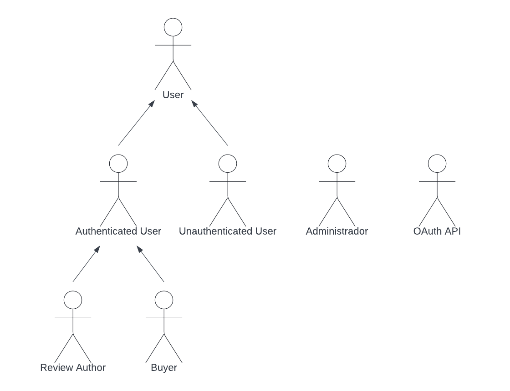

# ER: Requirements Specification Component

 TechLab é uma plataforma web de compras online que permite aos seus utlizadores acesso a um vasto catálogo de produtos informáticos.

## A1: TechLab
A TechLab está a ser desenvolvida por um pequeno grupo de desenvolvedores(stakeholders) como um produto direcionado a todas as pessoas que procurem adquirir algum tipo de artigo informático.

O principal objetivo deste projeto é desenvolver um sistema de informação com interface web prático e fiável para suporte a lojas online. Para dispor de uma grande variedade de produtos, a loja venderá várias marcas de tecnologia assim como produtos de todo o espetro da informática como computadores, smartphones, acessórios e tablets.

Esta aplicação permite aos seus utilizadores criarem uma lista de artigos que pretendam adquirir bem como visualizar o histórico de todas as compras anteriores, para tal será necessário criar uma conta na plataforma. Os usuários terão também a possibilidade de avaliar os produtos através de uma pontuação e/ou comentário.

A plataforma terá um design simples e intuitivo independentemente do dispositivo ulitizado no seu acesso, com uma navegação rápida e com facilidade em encontrar os artigos desejados.

Os utilizadores estão divididos em grupos com permissões diferentes: administradores, utilizadores autênticados e não autênticados. Os administradores têm todos os privilégios de acesso ao sistema, toda a informação dos perfies dos clientes, podem atualizar os produtos disponíveis e excluir reviews, no entanto não podem realizar compras ou reviews aos artigos. Os utilizadores não autênticados (visitantes) podem navegar pelo website vendo todos os produtos em exposição e os seus detalhes/comentários. Por último, os utilizadores autênticados terão todos os privilégios dos não autênticados bem como realizar compras e reviews, criar listas de artigos (wishlist) e gerir o seu perfil.

---

## A2: Actors and User stories

Este artefacto contém a descrição e a identificação de todos os atores e respetivas user stories. 

### 1. Actors

|  |
|:--:|
| Figura 1: Atores da ... |

| Identificador | Descrição |
| -------------------- |  ------------------------------------------------------------------------------ |
| User          | Utilizador genérico que têm acesso a toda a informação pública podendo visualizar os produtos e respetivas reviews|
| Unauthenticated User     |  Utilizador não autenticado que poderá registar-se(sign-up) ou fazer login no sistema|
| Authenticated User | Utilizador autenticado que pode fazer compras, gerenciar informação pessoal através do seu perfil e criar uma wishlist |
| Review author     | Utilizador autenticado que pode remover e editar as suas avaliações|
| Buyer     |  Utilizador autenticado que realizou pelo menos uma compra; pode dar reviews nos artigos adquiridos, acompanhar e cancelar encomendas|
| Administrador     | Utilizador autenticado responsável por gerenciar produtos, encomendas e utilizadores|
| OAuth API | OAuth API externo que pode ser usado para registar ou auntenticar no sistema|

Tabela 1: Descrição dos atores da TechLab

### 2. User Stories

#### 2.1. User 

| Identificador | Nome | Prioridade | Descrição |
| ---------------- | ------------------------- | ---------------- | ------------------------------------------------------------------------------ |
| US01       | Ver a lista de produtos | Alta | Como *User*, quero ver a lista de produtos, para saber o que poderei adquirir |
| US02       | Ver os detalhes dos produtos | Alta | Como *User*, quero ver os detalhes dos produtos, para me ajudar na escolha dos mesmos |
| US03       | Adicionar produtos ao cesto de compras | Alta | Como *User*, quero adicionar produtos ao cesto de compras, para os poder adquirir |
| US04       | Gerir cesto de compras | Alta | Como *User*, quero gerir o cesto de compras, para poder gerir as minhas opções de compra|
| US05       | Procurar produtos | Alta | Como *User*, quero procurar produtos, para facilmente encontrar aquilo que procuro|
| US06       | Procurar categorias de produtos | Média | Como *User*, quero ver as categorias dos produtos, para os poder encontrar mais facilmente |
| US07       | Ver as avaliações dos produtos | Média | Como *User*, quero ver as avaliações dos produtos, para me ajudar na escolha dos mesmos |
| US08       | About Page | Média | Como *User*, quero ver ter acesso à about page, para obter mais informações sobre o website |
| US09   | Ordenar por | Baixa | Como *User*, quero ordenar os produtos disponíveis por preço ou review, para poder ter uma visão mais organizada e facilmente descartar opções de compra em caso de dúvida |    

Tabela 2: User`s user stories.

#### 2.2. Unauthenticated User

| Identificador | Nome | Prioridade | Descrição |
| --------------- | ----------- | -------------------- | ------------------------------------------------------------------------------ |
| US11       | Sign-in | Alta | Como *Unauthenticated User*, quero autenticar-me no sistema, para poder aceder a informação privilegiada |
| US12       | Sign-up | Alta | Como *Unauthenticated User*, quero inscrever-me no sistema, para me poder autenticar-me no sistema  |
| US13       | OAuth API Sign-in | Baixa | Como *Unauthenticated User*, quero auntenticar-me no sistema com uma conta externa, para não necessitar de criar uma conta nova na plataforma  |
| US14       | OAuth API Sign-up | Baixa | Como *Unauthenticated User*, quero inscrever-me no sistema com uma conta externa, para poder autenticar-me no sistema  |

Tabela 3: Unauthenticated User's user stories.

#### 2.3. Authenticated User

| Identificador | Nome | Prioridade | Descrição |
| ---------------- | -------------------| --------------- | ------------------------------------------------------------------------------ |
| US21       | Ver perfil | Alta | Como *Authenticated User*, quero ver o meu perfil, para poder ver aceder às minhas informações e verificar se tudo está correto |
| US22       | Editar perfil | Alta | Como *Authenticated User*, quero editar o meu perfil, para poder atualizar a minha informação |
| US23      | Ver histórico de compras | Alta | Como *Authenticated User*, quero ver o meu histórico de compras, para poder ver os produtos que adquiri |
| US24 | Realizar checkout | Alta | Como *Authenticated User*, quero realizar checkout, para poder proceder à compra dos produtos |
| US25       | Adicionar um produto à wishlist | Média | Como *Authenticated User*, quero adicionar um produto à wishlist, para futuramente decidir se o pretendo adquirir |
| US26       | Gerir wishlist | Média | Como *Authenticated User*, quero gerir a wishlist, para adicionar ou remover produtos conforme necessário |
| US27       | Avaliar um produto | Média | Como *Authenticated User*, quero avaliar os produtos que adquiri |
| US28       | Reportar uma avaliação | Baixa | Como *Authenticated User*, quero reportar uma avaliação, para ajudar os administradores a manter as avaliações justas e não ofensivas |

Tabela 4: Authenticated User's user stories.

#### 2.4 Review Author

| Identificador | Nome | Prioridade | Descrição |
| ---------------- | -------------------| --------------- | ------------------------------------------------------------------------------ |
| US31       | Editar avaliação | Média | Como *Review Author*, quero editar a minha avaliação, para poder corrigir eventuais erros ou alterar alguma informação |
| US32       | Remover avaliação | Média | Como *Review Author*, quero remover a minha avaliação, para que os outros utilizadores não a consigam ler |

Tabela 5: Review Author`s user stories.

#### 2.5 Buyer

| Identificador | Nome | Prioridade | Descrição |
| ---------------- | -------------------| --------------- | ------------------------------------------------------------------------------ |
| US41       | Avaliar produto comprado | Média | Como *Buyer*, quero avaliar o produto comprado, para ajudar outros utilizadores na compra dos seus produtos |
| US42       | Acompanhar a encomenda| Média | Como *Buyer*, quero acompanhar a minha encomenda, para saber em que estado é que se encontra |
| US43       | Cancelar pedido | Média | Como *Buyer*, quero cancelar o meu pedido, para o caso de já não queres adquirir os produtos |

Tabela 6: Buyer`s user stories.

#### 2.6 Administrator

| Identificador | Nome | Prioridade | Descrição |
| ---------------- | -------------------| --------------- | ------------------------------------------------------------------------------ |
| US51       | Adicionar produto | Alta | Como *Administrator*, quero adicionar um produto, para os utilizadores o poderem comprar |
| US52       | Gerir informação dos produtos | Alta | Como *Administrator*, quero gerir a informação dos produtos, para informar os *Users* sobre os mesmos |
| US53       | Gerir stock dos produtos | Alta | Como *Administrator*, quero gerir o stock dos produtos, para não haver produtos a esgotar e conseguir gerir a procura dos clientes |
| US54       | Gerir as categorias dos produtos | Alta | Como *Administrator*, quero gerir as categorias dos produtos, para facilitar a navegação por parte dos utilizadores |
| US55       | Ver o histórico de compras dos utilizadores | Média | Como *Administrator*, quero ver o histórico de compra dos utilizadores, para saber os produtos que são mais comprados|
| US56      | Gerir o estado das encomendas | Média | Como *Administrator*, quero gerir o estado das encomendas, para informar os compradores sobre o mesmo |
| US57      | Gerir avaliações reportadas | Baixa | Como *Administrator*, quero gerir as avaliações reportadas, para manter as avaliações justas e não ofensivas |

Tabela 7: Administrator`s user stories.

### 3. Supplementary Requirements

#### 3.1. Business rules

| Identificador | Nome | Descrição |
| ---------------- | -------------------| ------------------------------------------------------------------------------ |
| BR01       | Cliente | Apenas os utilizadores autenticados podem comprar na loja, o administrador não pode realizar esta ação. |
| BR02 | Data de retorno | Os produtos adquiridos não podem ser devolvidos passados mais de 10 dias da compra. |
| BR03 | Stock | Não podem ser adquiridos produtos que não se encontrem em stock |
| BR04 | Histórico de conta apagada | Após a eliminação da conta de um utilizador os dados partilhados (comentários,reviews,etc) são mantidos mas de forma anónima. |

Tabela 8: TechLab Business rules.

#### 3.2. Technical requirements

| Identificador | Nome | Descrição |
| ---------------- | -------------------| ------------------------------------------------------------------------------ |
| **TR01** | **Disponibilidade** | **A loja deve estar funcional todos os dias durante 24 horas. Se a plataforma não estiver sempre disponível pode levar a um grande prejuízo para a empresa e comprometer eventuais entregas de produtos a clientes**|
| TR02 | Acessibilidade | A loja deve ser acessível independentemente da condição da pessoa, browser e sistema operativo utilizado |
|**TR03** | **Usabilidade** | **O sistema da loja deve ser intuitivo e fácil de usar,foi idealizado para todo o tipo de procura de material a nível informático independentemente das necessidades dos utilizadores** |
| TR04 | Aplicação web | O sistema deve ser implementado como uma aplicação web para fornecer suporte a uma loja online (HTML, JavaScript, CSS e PHP)|
| TR05 | Portabilidade | O sistema deve funcionar em várias plataformas (windows,linux,Mac os,etc.), para ser facilmente disponível a uma grande base de usuários|
| **TR06** | **Segurança** | **O sistema deve proteger as informações de acesso dos ulilizadores à plataforma através do uso de um sistema de autenticação e verificação** | 
| TR07 | Robustês | O sistema deve ser capaz de lidar com erros de tempo de execução continuando a operar |
| TR08 | Escalabilidade | O sistema deve estar preparado para lidar com o aumento de utilizadores/compradores |
| TR09 | Ética | O sistema deve respeitar os princípios éticos no desenvolvimento de software(detalhes pessoais dos usuários ou dados de uso,nem compartilhar os mesmos sem conhecimento dos próprios)| 
| TR10 | Performance | O sistema deve ser rápido e ter tempos de resposta inferiores a 2s para garantir a atenção dos utilizadores|

Tabela 9: TechLab Technical requirements.

#### 3.3. Restrictions

| Identificador | Nome | Descrição | 
| ---------------- | -------------------| ------------------------------------------------------------------------------ |
| C01 | Prazo | O sistema deve estar operacional até ao final do semestre| 

Tabela 10: TechLab Restrictions.

---

## A3: Information Architecture

> Brief presentation of the artefact goals.

### 1. Sitemap

> Sitemap presenting the overall structure of the web application.  
> Each page must be identified in the sitemap.  
> Multiple instances of the same page (e.g. student profile in SIGARRA) are presented as page stacks.

### 2. Wireframes

> Wireframes for, at least, two main pages of the web application.
> Do not include trivial use cases.

#### UIxx: Page Name

#### UIxx: Page Name

---

## Revision history

Changes made to the first submission:
1. Item 1
1. ...

***
GROUP22114, DD/MM/2022

* António Pedro Cabral dos Santos, up201907156 up201907156@up.pt
* João Margato Borlido Pereira, up201907007 up201907007@up.pt 
* Miguel Ângelo Pacheco Valente, up201704608 up201704608@up.pt